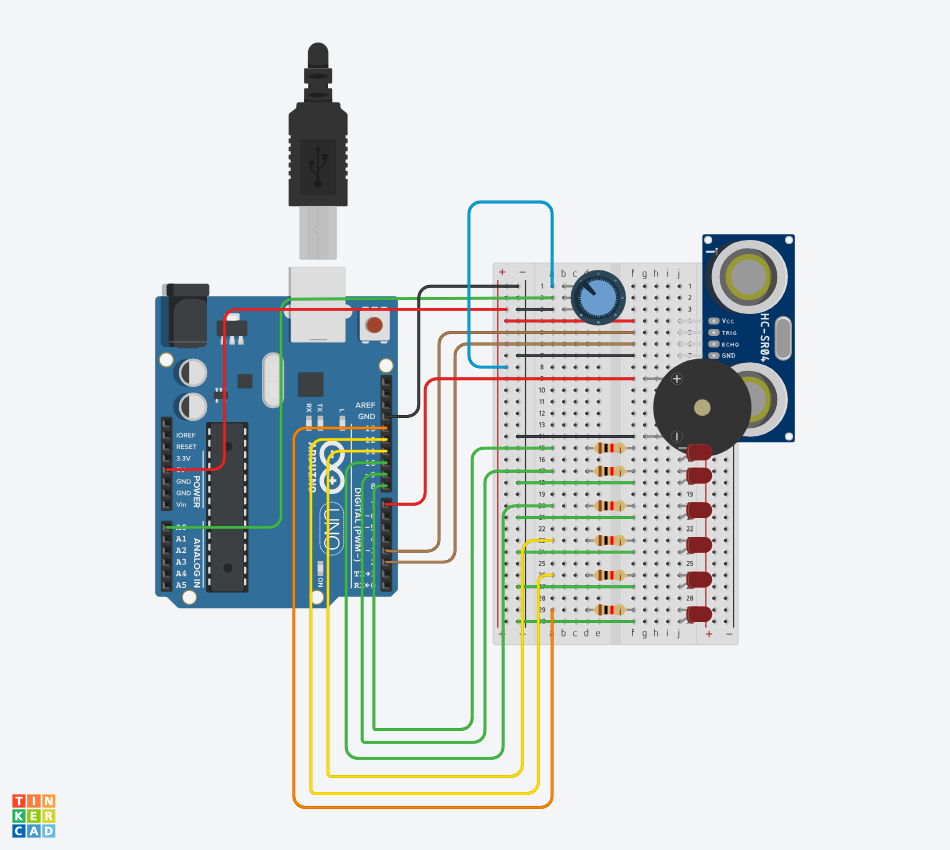

# 📡 Sensor de Proximidade com Arduino

> Projeto desenvolvido como parte da disciplina de **Sistemas Embarcados**.

O sistema utiliza um sensor ultrassônico para detectar a proximidade de objetos e fornece **feedback visual e sonoro** de acordo com a distância medida.

---

## ⚙️ Funcionamento

O comportamento do sistema é baseado na distância entre o sensor e um objeto:

- 🔊 Quanto mais próximo o objeto estiver, **menor será o intervalo** entre os sons emitidos pelo buzzer.
- 💡 Quanto mais próximo o objeto estiver, **maior será a quantidade de LEDs acesos**.
- 🎛️ Um **potenciômetro** permite ao usuário ajustar a distância máxima considerada pelo sensor.

---

## 🧰 Componentes Utilizados

| Componente | Quantidade |
|---|---|
| Arduino Uno | 1 |
| Sensor ultrassônico HC-SR04 | 1 |
| Buzzer | 1 |
| LEDs | 5 |
| Resistores (para os LEDs) | 5 |
| Potenciômetro | 1 |
| Protoboard | 1 |
| Jumpers | — |

---

## 📁 Estrutura do Repositório

```
.
├── sensorarduino.ino   # Código-fonte do Arduino
└── prototipo.png       # Esquema do circuito montado
```

---

## 🚀 Como Executar

1. Clone este repositório:
   ```bash
   git clone https://github.com/MatheussPiccoli/Trabalho_01_embarcados.git
   ```

2. Abra o arquivo `sensorarduino.ino` na **Arduino IDE**.

3. Monte o circuito conforme o arquivo `prototipo.png`.

4. Faça o upload do código para o **Arduino Uno**.

---

## 🧠 Lógica do Sistema

O sensor **HC-SR04** mede continuamente a distância até um objeto. Com base nessa distância:

- O **buzzer** emite sons em intervalos cada vez menores conforme o objeto se aproxima.
- Os **LEDs** acendem progressivamente para indicar visualmente o nível de proximidade.
- O **potenciômetro** ajusta a distância máxima de detecção.

---

## 🖼️ Imagem do Protótipo



---

## 🎯 Objetivo do Projeto

Este projeto teve como objetivo aplicar conceitos de:

- Sistemas embarcados
- Leitura de sensores
- Controle de atuadores
- Processamento de sinais analógicos

Além disso, foi uma oportunidade para retomar conhecimentos adquiridos anteriormente em **Engenharia Elétrica**.

---

## 👤 Autor

**Matheus Piccoli**
